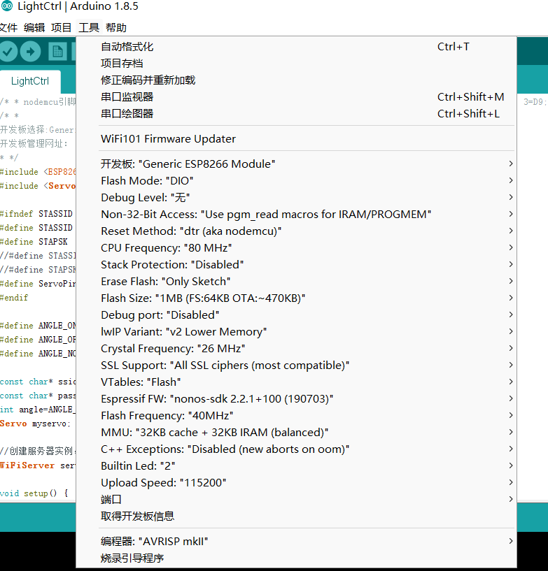

# SteeringGearControl
Android App控制SG90舵机，通过WiFi传输数据(ESP8266模块)

**Android模块**

- Code/AndroidCode

  在Android代码中详细写明了，如何通过Wifi串口读取，Arduino传来的数据信息

**Arduino模块**

- Code/ArduinoCode

​	Arduino代码十分简单，主要用于驱动SG90舵机以及使用ESP8266传输WiFi数据

*阴暗地爬行*.jpg
